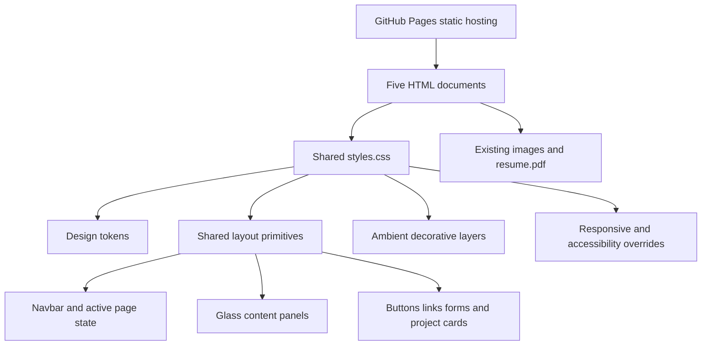

# Design Document: Frutiger Aero Portfolio

## Overview

`frutiger-aero-portfolio` evolves Andy Sin's existing five-page static portfolio into a cohesive Frutiger Aero experience: bright sky/water gradients, translucent glass surfaces, glossy highlights, friendly bubbles, and restrained motion that makes the interface feel alive without competing with the content. The feature applies consistently to `index.html`, `blog.html`, `portfolio.html`, `resume.html`, and `contact.html` through the shared `styles.css` stylesheet.

The implementation remains static HTML5 and CSS3 deployed through GitHub Pages. Existing semantic markup, relative asset paths, page-specific active navigation state, and content remain the source of truth. Every page must expose exactly one `main` landmark and exactly one named primary-navigation landmark. No framework, build step, backend, or mandatory JavaScript runtime is introduced; CSS provides the visual system and motion, while semantic HTML and progressive enhancement preserve a usable baseline. Navigation, forms, primary content, and enhanced reading must remain available without JavaScript; any optional enhancement degrades gracefully.

## Goals and Non-Goals

### Goals

- Establish a recognizable Frutiger Aero visual language across all pages.
- Make the existing portfolio content easier and more delightful to scan.
- Add bubbles, cloud-like ambient forms, glossy surfaces, and layered motion.
- Keep the site responsive from small mobile screens through wide desktop layouts.
- Preserve keyboard access, readable contrast, semantic landmarks, and reduced-motion support.
- Keep page load behavior appropriate for a small static GitHub Pages site.

### Non-Goals

- Replacing the site with a JavaScript framework, CMS, or component runtime.
- Adding accounts, content management, a database, or a server-side contact workflow.
- Making every element continuously animate; content and navigation must remain stable.
- Rewriting Andy's copy, resume data, or project imagery as part of the visual feature.
- Adding autoplay audio, video backgrounds, or motion that is required to understand content.

## Architecture



Each page keeps its existing document structure and links to `styles.css`. The stylesheet is organized conceptually into tokens, reset/base rules, shared shell, reusable surfaces, page-specific composition, motion, and media/accessibility overrides. Decorative visuals are generated with CSS pseudo-elements where practical so they do not require additional network assets.

## Components and Interfaces

| Page | Existing content boundary | Frutiger Aero treatment |
| --- | --- | --- |
| Home (`index.html`) | Hero title, avatar, introduction, CTA | Sky-stage hero, avatar orb/gloss treatment, floating bubbles, CTA lift and shimmer |
| Blog (`blog.html`) | Page title and article card | Cloud/glass reading panel, soft entrance, readable text measure, decorative bubbles kept peripheral |
| Portfolio (`portfolio.html`) | Four project cards and GitHub link | Glossy project cards, image hover lift, aqua/lime metadata, staggered reveal where supported |
| Resume (`resume.html`) | Intro, GitHub link, resume sections | Glass resume sheet, section dividers, calm reveal, high-contrast print-friendly treatment |
| Contact (`contact.html`) | Contact copy and form | Split glass layout, focused field glow, submit button feedback, no animation-dependent validation |

### Shared Visual System

#### Palette and material

- Sky base: pale cyan-to-cloud gradients with a saturated aqua accent.
- Water accent: turquoise and deep blue for links, controls, and active states.
- Life accent: lime for highlights, focus rings, calls to action, and selected decorative bubbles.
- Surface: translucent white glass with a visible white edge, soft aqua shadow, and a restrained backdrop blur.
- Ink: dark blue text for body content; muted blue for supporting metadata.
- Decorative white: cloud highlights and specular gloss, never used as the only distinction for controls.

The current variables (`--ink`, `--muted`, `--sky`, `--aqua`, `--deep-aqua`, `--lime`, `--cloud`, `--glass`, `--edge`, `--shadow`) remain the token foundation. New tokens should be added for animation duration, easing, panel radius, and layered shadow rather than scattering literal values through selectors.

#### Shape language

- Use large rounded rectangles for panels and pill-shaped controls.
- Use circles and irregular radial gradients for bubbles, clouds, and water droplets.
- Retain the current generous rounded corners and large title typography.
- Avoid excessive skeuomorphic beveling that reduces text contrast or makes controls look non-interactive.

#### Depth model

1. Page background gradients and fixed ambient forms.
2. Content-level bubbles/clouds behind content with `pointer-events: none`.
3. Navbar and content glass surfaces.
4. Images and controls with local highlights.
5. Text and focus indicators above all decorative layers.

## Data Models

The current site uses content embedded directly in HTML. This feature does not introduce a data store. The conceptual content model is:

```pascal
STRUCTURE SitePage
  id: String
  title: String
  description: String
  path: String
  activeNavigationLabel: String
END STRUCTURE

STRUCTURE ProjectCard
  name: String
  summary: String
  imagePath: String
  imageAlt: String
  technologies: List[String]
  destination: String
END STRUCTURE

STRUCTURE MotionPreference
  prefersReducedMotion: Boolean
  animationEnabled: Boolean
END STRUCTURE
```

HTML remains the authoritative representation. Repeated navigation labels, active-page state, image alternative text, project descriptions, and resume entries must be updated in their respective documents rather than generated dynamically.

### Responsive and Accessibility Boundaries

- Desktop layouts may use layered decorations, two-column content, and larger motion distances.
- At the existing `760px` breakpoint, stacked layouts remain the primary behavior; decorative density and motion distance reduce.
- At narrow widths, the navbar remains readable and wraps without horizontal scrolling; bubbles may be hidden selectively, never by hiding content.
- Every page has exactly one `main` landmark and exactly one named primary navigation landmark. The five primary navigation links remain present with relative destinations.
- Decorative elements must be hidden from assistive technology with `aria-hidden="true"` when represented in HTML, must use `pointer-events: none`, and must not be focusable; pseudo-elements have no semantic role or focus target.
- All meaningful images retain descriptive `alt` text; decorative backgrounds do not replace content.
- Focus indicators remain visible above glass surfaces and take priority over decorative visibility at zoom; they never depend on hover.
- Text, links, form controls, and metadata require contrast against both the glass surface and the page gradient.
- `@media (prefers-reduced-motion: reduce)` disables continuous floating and transform-based entrance effects (or makes entrance transitions near-instant), while retaining content visibility, navigation, form operation, visible focus, and non-motion state changes regardless of why reduced motion is active.
- Content is visible and operable immediately when animation is unsupported or unavailable. A supported entrance animation may delay visual visibility only as explicitly designed, but its failure path must reveal the final state rather than leave content hidden.
- JavaScript is not required for navigation, forms, primary content, or enhanced reading; optional reading enhancements must degrade gracefully when scripts are disabled.
- Interaction states must not change layout or cause reflow. Visual changes outside hover and focus, including active/current, validation, and reduced-motion state changes, are permitted when they preserve the same layout bounds.
- The design remains usable with keyboard navigation, zoom, touch input, and without backdrop-filter support.

## Low-Level Design

### CSS Architecture

Organize the shared stylesheet in this order so later layers have predictable responsibility:

1. **External font import and design tokens**: color, radius, shadow, spacing, duration, easing, and maximum content widths.
2. **Global reset/base**: box sizing, document height, typography, body background, link defaults, and focus-visible rules.
3. **Ambient background**: body gradients and fixed pseudo-elements; no content-bearing selectors.
4. **Site shell**: `.navbar`, `.logo`, `.nav-list`, `main`, and `.footer`.
5. **Surface primitives**: `.glass-surface` conceptually represented by current `.post`, `.project`, `.contact-layout`, `.resume`, and `.about-text` selectors; shared declarations should be consolidated where safe.
6. **Controls and interaction states**: `.button`, `.github-button`, submit controls, links, inputs, and textareas.
7. **Page compositions**: `.about`, `.project-grid`, `.contact-layout`, `.resume`, and section-specific layout.
8. **Motion utilities and keyframes**: named, low-amplitude animations with explicit ownership.
9. **Responsive overrides**: layout stacking, type/spacing adjustments, reduced decoration.
10. **Preference/print overrides**: reduced motion, forced colors where applicable, and print styles for resume content.

Suggested additional tokens:

```pascal
DEFINE --radius-panel AS 2rem
DEFINE --radius-image AS 2.3rem
DEFINE --duration-fast AS 180ms
DEFINE --duration-medium AS 420ms
DEFINE --duration-ambient AS 14s
DEFINE --ease-spring AS cubic-bezier(0.2, 0.8, 0.2, 1)
DEFINE --ease-soft AS ease-in-out
DEFINE --content-width AS 1020px
DEFINE --shell-width AS 1120px
```

### Component/Class Structure

These are CSS/HTML responsibilities, not framework components:

- `.navbar`: translucent navigation shell, rounded edge, elevated above page ambience.
- `.logo`: circular aqua identity mark with glossy inset highlight.
- `.nav-list` and `.nav-list a`: wrapped links, active-page pill, hover/focus state.
- `.page-title`: display heading with cloud-white text shadow and restrained entrance.
- `.about`, `.about-image`, `.about-text`: home hero composition and avatar depth layers.
- `.post`, `.project`, `.contact-layout`, `.resume`: shared glass surfaces with consistent border, blur fallback, radius, and shadow.
- `.project-grid`, `.project-image`, `.project-details`: portfolio card layout and media interaction.
- `.eyebrow`, `.tech-list`, `.section-title`: aqua metadata hierarchy.
- `.button`, `.github-button`, `input[type="submit"]`: actionable controls with lime lift state.
- `.section`, `.entry`, `.entry-title`, `.entry-info`: resume information hierarchy.
- `.footer`: low-contrast but readable page closure.
- `.ambient-bubble` (optional HTML decoration): only for decorative elements that need independent placement; must be `aria-hidden="true"` and `pointer-events: none`.

Prefer existing selectors and shared declarations over introducing duplicate variants. If a new hook is needed, name it for visual responsibility rather than page-specific implementation detail.

### Animation Strategy

Motion is layered and purposeful:

1. **Ambient motion**: a small number of bubbles/clouds drift slowly using `transform`, `opacity`, or another visual-only non-layout property. This includes transforms on pseudo-elements and applicable SVG animation properties when supported.
2. **Page entrance**: title and primary content surface may use a short supported entrance effect. The implementation must not depend on it for operability; unsupported, blocked, or failed animation must expose the final visible state.
3. **Interactive motion**: links, cards, and buttons use short translate/shadow/color/border transitions on hover and focus-visible. These changes occur within 300ms, stay within 4px when translated, and never alter layout bounds. Touch devices receive no hover-only requirement.
4. **Specular motion**: optional low-contrast highlight sweep on selected controls/cards, never across body text and never continuously on every card.
5. **Staggering**: portfolio cards may use small, capped delays using `:nth-child` selectors only if static markup remains operable and the effect is disabled under reduced motion.

Animation rules:

- Animate only visual-only properties that do not trigger layout. `transform` and `opacity` are preferred, but applicable color, border, shadow, filter, pseudo-element transform, and SVG animation properties may be used where they do not change layout.
- Keep ambient loops at 12–20 seconds and interactive transitions below 300ms.
- Do not make navigation, form labels, or long text move continuously.
- Avoid simultaneous large movements that can cause visual fatigue.
- Do not use JavaScript timers or scroll listeners for core behavior. If a timer fallback is later justified, CSS visual-only animation remains the primary ambient method and the fallback cannot be required for operation.

### Interaction Behavior

The existing pages must encode the current-page state in static markup for every document load and normal navigation transition. A future enhancement may validate or synchronize it, but cannot be the source of truth or create a second active item:

```pascal
PROCEDURE validatePageState(currentDocument)
  currentPath ← normalizePath(currentDocument.location)
  currentItems ← navigationLinksWithAttribute(currentDocument, "aria-current", "page")

  ASSERT count(currentItems) = 1
  ASSERT normalizePath(currentItems[0].href) EQUALS currentPath
  ASSERT currentItems[0] HAS active styling

  FOR each navigationLink IN currentDocument.navbar.links DO
    IF navigationLink IS NOT currentItems[0] THEN
      ASSERT navigationLink HAS NO "aria-current" attribute
      ASSERT navigationLink HAS NO active styling
    END IF
  END FOR
END PROCEDURE
```

The preferred implementation is CSS media-query behavior and static HTML. JavaScript, if ever added, may expose optional state for progressive enhancements but must not be needed to read, navigate, submit, operate forms, or use enhanced reading; any enhancement must degrade gracefully.

Expected states:

- **Default**: glass panels, ambient movement, hover/focus transitions, with primary content visible.
- **Hover/focus-visible**: a card/control may gain color, border, shadow, or a small lift; the same layout bounds are preserved and focus remains above decoration.
- **Active/current page**: exactly one navigation link has the existing active styling and `aria-current="page"` on every page load and transition.
- **Reduced motion**: no floating loops or transform entrance movement; content remains visible and all navigation, form, focus, and non-motion state changes remain available.
- **Unsupported animation**: primary content and controls are immediately visible and operable in their final state.
- **Unsupported backdrop blur**: translucent background plus sufficiently opaque fallback, solid-enough edge, and shadow preserve legibility.
- **Home sky-stage failure**: if styling required for the complete home sky-stage is unavailable or fails, the page presents an explicit, perceivable error/status indication rather than silently appearing as unstyled content.
- **Print**: resume content loses decorative gradients/shadows and prints as high-contrast document content.

### Detailed Pseudocode for Visual Composition

```pascal
PROCEDURE renderFrutigerAeroPage(page)
  APPLY baseTypography(page)
  APPLY skyGradientBackground(page)
  APPLY glassSurfaceToSharedPanels(page)
  APPLY pageSpecificComposition(page)

  IF page.supportsDecorativeBubbles THEN
    FOR each bubble IN page.decorativeBubbles DO
      bubble.ariaHidden ← TRUE
      bubble.pointerEvents ← NONE
      bubble.animation ← ambientFloat(bubble.duration, bubble.delay)
    END FOR
  END IF

  IF userPrefersReducedMotion() THEN
    disableAmbientAnimation(page)
    removeEntranceTransforms(page)
  END IF

  ASSERT count(page.mainLandmarks) = 1
  ASSERT count(page.namedPrimaryNavigationLandmarks) = 1
  ASSERT exactlyOneCurrentNavigationItem(page)
  ASSERT allMeaningfulImagesHaveAltText(page)
  ASSERT allInteractiveElementsHaveVisibleFocusState(page)
  ASSERT interactionStatesPreserveLayoutBounds(page)
  ASSERT decorationIsNonInteractiveAndHiddenFromAT(page)
END PROCEDURE
```

```pascal
PROCEDURE activateProjectCard(card)
  WHEN pointerOrKeyboardFocusEnters(card) DO
    elevate(card, amount = small)
    strengthenShadow(card)
    preserveImageAspectRatio(card)
  END WHEN

  WHEN pointerOrKeyboardFocusLeaves(card) DO
    restoreElevation(card)
    restoreShadow(card)
  END WHEN

  WHEN reducedMotionIsEnabled() DO
    preserveLayout(card)
    changeOnlyColorAndBorder(card)
  END WHEN
END PROCEDURE
```

## Correctness Properties

### Property 1: Navigation consistency

**Validates: Requirements 1.1**

For every page load and same-site navigation transition, exactly one primary navigation link points to the current document and has both active styling and `aria-current="page"`; all other primary links have neither current-page meaning nor duplicate active state. Navigation uses the relative destination without requiring JavaScript or a server endpoint.

### Property 2: Content and sky-stage preservation

**Validates: Requirements 2.1**

Applying the visual system changes presentation only; every existing heading, paragraph, link destination, form control, resume entry, project description, and meaningful image remains available. On `index.html`, the complete sky-stage composition is either presented or an explicit perceivable styling-failure indication is shown; it must not silently fall back to unstyled content.

### Property 3: Layout safety and focus priority

**Validates: Requirements 3.1**

For every supported viewport width and zoom level, no decoration or interaction state causes horizontal overflow, layout shift, clipped focus indicators, or overlap that obscures readable content. When focus and decoration conflict, focus visibility takes priority.

### Property 4: Motion independence and stable interaction

**Validates: Requirements 4.1**

If animation is unsupported, blocked, or fails, all primary content and controls are visible and operable without waiting. Supported entrance animation may delay visibility only while it runs, but its fallback must reveal the final state. Hover/focus and other permitted visual state changes never change layout bounds, and continuous decoration stays within the count, duration, travel, and stationary-content limits.

### Property 5: Reduced-motion compliance

**Validates: Requirements 5.1**

When `prefers-reduced-motion: reduce` matches, all continuous ambient loops and transform-based entrance effects are disabled or near-instant. Content visibility, navigation, form operation, focus indicators, and non-motion state changes remain available regardless of whether the preference came from the operating system, browser, or another cause.

### Property 6: Keyboard parity and landmarks

**Validates: Requirements 6.1**

Every interactive element has a visible `:focus-visible` state and the same meaningful outcome through pointer and keyboard interaction. Every page has exactly one `main` landmark and exactly one named primary navigation landmark, meaningful images have descriptive alternatives, and text/control boundaries meet the specified contrast ratios.

### Property 7: Decorative isolation

**Validates: Requirements 7.1**

Decorative HTML elements are hidden from assistive technology, use `pointer-events: none`, cannot receive focus, remain behind readable content, and are never the only representation of meaningful information. Pseudo-elements have no semantic or focus target.

### Property 8: Visual and print fallback

**Validates: Requirements 8.1**

Without backdrop filtering, external fonts, or CSS animation, surfaces and content retain readable contrast, hierarchy, and immediate operability. Printed resume output preserves content and hierarchy without decorative overflow or overlap.

### Property 9: Static deployability and progressive baseline

**Validates: Requirements 9.1**

Every page and existing relative asset loads from a static host using the current files. Navigation, forms, primary content, and enhanced reading remain available without JavaScript or degrade gracefully; no server endpoint, bundle, data store, tracking, autoplay media, or required runtime is introduced.

### Property 10: Performance discipline

**Validates: Requirements 10.1**

Decoration uses CSS, pseudo-elements, or existing assets within the asset-size and animation-count limits; animated properties are visual-only and non-layout. Existing image dimensions remain explicit, one shared stylesheet remains authoritative, and any timer fallback is subordinate to CSS visual-only animation.

## Error Handling

- Missing image: preserve the image's `alt` text and surrounding card layout; do not rely on a decorative background as the only project representation.
- Complete home sky-stage styling unavailable or failed: expose a perceivable status/error indication on the home page (without hiding or replacing the hero content) rather than silently presenting an unstyled composition. The indication must remain readable, keyboard-safe, and noninteractive unless it provides an actual recovery action.
- Font import unavailable: fall back to the existing system/UI font stack with unchanged hierarchy and readable line lengths.
- `backdrop-filter` unavailable: use the sufficiently opaque surface, visible border, and shadow fallback.
- CSS animation unsupported or blocked: show content and controls immediately in their final visible, operable state; never use a hidden-until-animated dependency.
- Reduced-motion preference unavailable or active for any cause: keep content visible and operation available, with motion nonessential and state changes expressed through non-motion styling.
- Narrow viewport or high zoom: stack multi-column groups, allow navbar wrapping, reduce decorative density, prioritize focus indicators, and prevent horizontal scrolling or decoration overlap.
- JavaScript disabled: native links, form controls, primary content, and core reading remain available; optional enhanced reading behavior is omitted or degrades to the underlying document.
- Form delivery remains outside this feature: the existing static form retains its HTML behavior and clearly communicates if delivery is not wired to a backend.

## Testing Strategy

### Manual and structural checks

- Open every page at mobile, tablet, desktop, and 100%–400% zoom-equivalent layouts.
- Verify exactly one active/current navigation item, exactly one `main`, and exactly one named primary-navigation landmark on every page and after normal navigation transitions.
- Verify the home page shows the complete sky-stage or a perceivable styling-failure indication; test the failure path rather than silently accepting an unstyled fallback.
- Test with mouse, keyboard, touch, and a screen reader or accessibility tree inspector; confirm focus indicators take priority over decoration.
- Toggle reduced motion through the operating system/browser and confirm loops and entrance transforms stop while content, navigation, forms, focus, and state changes remain available.
- Disable JavaScript and test navigation, form controls, primary content, and graceful degradation of enhanced reading.
- Disable backdrop blur, external fonts, and CSS animation to verify legible fallbacks and immediate operability.
- Print `resume.html` and confirm decorations do not obscure or wastefully dominate resume content.

### Automated checks

- Validate HTML structure, unique page titles, exactly one `main`, exactly one named primary navigation landmark, and exactly one `aria-current="page"` item per page.
- Run an accessibility audit for landmark names, contrast, focus visibility, image alternatives, heading hierarchy, decorative isolation, and form associations.
- Check each page for horizontal overflow, decoration/content overlap, focus clipping, and interaction-state layout shift at representative viewport widths and zoom levels.
- Use visual regression screenshots for shared navbar, home hero and failure indication, project cards, resume panel, and contact form in default, reduced-motion, fallback, and print states.
- Inspect animation declarations for count, duration, travel bounds, CSS-primary behavior, and visual-only non-layout properties, including pseudo-elements and applicable SVG properties.
- Verify JavaScript-independent navigation/forms/content and that no required runtime, endpoint, or bundle is referenced.

### Property-oriented checks

```pascal
PROPERTY everyPageHasExactlyOneCurrentItemAndLandmarks
  FOR each page IN sitePages DO
    ASSERT count(navigationItemsWithAriaCurrent(page, "page")) = 1
    ASSERT count(page.mainLandmarks) = 1
    ASSERT count(page.namedPrimaryNavigationLandmarks) = 1
  END FOR
END PROPERTY

PROPERTY homeStageFailureIsIndicated
  WHEN completeHomeSkyStageIsUnavailable() DO
    ASSERT home.hasPerceivableStyleFailureIndication
    ASSERT home.primaryContentIsNotSilentlyReplaced
  END WHEN
END PROPERTY

PROPERTY reducedMotionNeverHidesContent
  WHEN reducedMotionMediaQueryMatches() OR reducedMotionIsForcedForAnyCause() DO
    FOR each primaryContent IN allPages.primaryContent DO
      ASSERT primaryContent.isVisibleAndOperable
    END FOR
  END WHEN
END PROPERTY

PROPERTY interactionDoesNotShiftLayout
  FOR each interactiveElement IN allPages.interactiveElements DO
    ASSERT bounds(interactiveElement, defaultState) = bounds(interactiveElement, hoverOrFocusState)
  END FOR
END PROPERTY

PROPERTY decorativeLayersAreNonInteractive
  FOR each decorativeElement IN allPages.decorativeElements DO
    ASSERT decorativeElement.isNotFocusable
    ASSERT decorativeElement.pointerEvents = NONE
    ASSERT decorativeElement.isHiddenFromAssistiveTechnology
  END FOR
END PROPERTY
```

## Performance Considerations

- Prefer CSS gradients, pseudo-elements, applicable SVG visual animation, and existing assets over large raster background assets.
- Keep continuously animated decorative elements within six at desktop and three at mobile; use fewer on mobile where practical.
- Animate only visual-only non-layout properties. `transform` and `opacity` are preferred, but color, border, shadow, filter, pseudo-element transforms, and applicable SVG animation properties are permitted when layout bounds remain unchanged.
- Keep ambient durations between 12 and 20 seconds, positional travel within the requirements, and interaction transitions below 300ms.
- CSS visual-only animation remains the primary method. A JavaScript timer fallback, if later justified, may support continuity but cannot replace CSS or become required for operation.
- Avoid `will-change` unless profiling demonstrates a benefit; remove it when the interaction ends if used.
- Keep existing image dimensions and explicit `width`/`height` attributes to reduce layout shifts.
- Preserve relative, cacheable assets and the current single stylesheet deployment model.

## Security and Privacy Considerations

- No new data collection, tracking, third-party runtime, or form-processing endpoint is introduced.
- External font loading remains optional; the system font fallback must be fully usable if it is blocked.
- Links opening new tabs retain `rel="noreferrer"` as in the existing site.
- Decorative markup must not be inserted from untrusted content; all visual class hooks are authored in the static repository.
- Any home sky-stage failure indication must not expose sensitive diagnostics or create an external reporting request.

## Dependencies and Implementation Boundaries

- Existing files: `index.html`, `blog.html`, `portfolio.html`, `resume.html`, `contact.html`, `styles.css`.
- Existing assets: `images/andy-avatar.svg`, `images/project-preview.svg`, `images/sinnerpad.png`, `images/lockednloaded.png`, `images/robot.jpg`, and `resume.pdf`.
- Existing external dependency: Google Fonts import, with local/system fallback.
- No new npm package, framework, JavaScript bundle, server, or build configuration is required.
- HTML/CSS implementation must preserve the existing static navigation, form controls, primary content, landmarks, meaningful images, relative assets, external-link attributes, and exactly-one current navigation item per page.
- Decorative HTML hooks, if necessary, are limited to non-focusable, assistive-technology-hidden, pointer-inert elements; pseudo-elements are preferred.
- JavaScript may only be optional progressive enhancement. It must not own navigation/current state, form operation, primary content visibility, enhanced reading availability, animation failure recovery, or the home sky-stage failure indication. If a timer fallback exists, it remains subordinate to CSS visual-only animation.
- This document is design-only. Implementation should be a separate task covering CSS and minimal authored markup hooks only where justified; it must not alter content semantics or introduce a required runtime.
